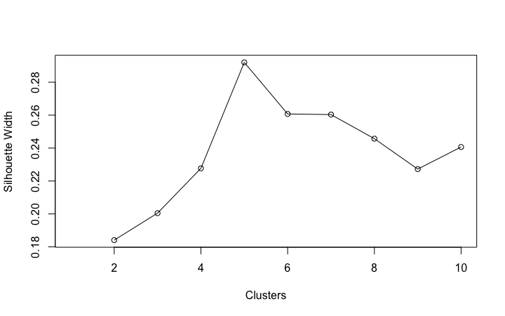

```{r setup, include = FALSE}
# library(kableExtra) # for example code; delete if not needed
library(readr)
library(tidyverse)
library(dplyr)
library(tidytext)
library(wordcloud)
library(textdata)
library(ggplot2)
library(cluster)
library(Rtsne)
library(ggplot2)
library(ggforce)
library(shiny)
library(plotly)
library(maps)
library(sf)
library(viridis)
library(shinythemes)  
library(bslib)
library(thematic)
library(shinyWidgets)  
library(DT)
library(ggrepel)

# Set code chunk defaults 
knitr::opts_chunk$set(echo = FALSE, 
                      mesage = FALSE,
                      warning = FALSE,
                      fig.align = "center")

# Set R environment options
options(knitr.kable.NA = '')
```

# Introduction

Everyone deserves access to quality health care. However, this is not a reality in the United States. There are systemic health inequities, and the marginalized populations suffer the consequences. To examine this issue, we focus our BLOG on regional health insurance coverage status, the role of intersectionality in health disparities, and people's experiences with public insurance.

We begin this BLOG with an overview of health care disparities in the United States by looking at how health insurance coverage status differs across states over time. We then analyze how socially disadvantaged populations experience greater obstacles to health based on their racial/ethnic group; socioeconomic status; gender and sexual orientation. Finally, in response to our shared passion for improving minority groups' access to quality health care, we present an analysis of quality of public health insurance by examining people's opinions about their health insurance plans captured in Medicare ratings data set.

## Affordable Care Act
The Affordable Care Act, which was passed under Obama administration in 2010 and began to take effect in 2014, attempted to expand healthcare coverage to low-income Americans of up to 138% of the poverty line. Yet, obtaining health insurance does not necessarily ensure better access to health care. It is reported that Medicare patients still face barriers to care, such as delayed treatment of chronic conditions, resulting in poorer health outcomes.

## Questions of Interest

1. What are the geographical differences of health care coverage in the United States and how has this changed over the years? 
2. Have the rates of health care coverage changed at a consistent pattern across races? Do some races have a higher rates of coverage?
3. What are the factors that drive health care inequity? Does intersectionality play a role in exacerbating inequality even in health care settings?
4. How can we address the inequality? Would improving Medicare help enhance the overall quality of health care?


# Data

**Dataset 1**

* [Link to the dataset](https://www2.census.gov/programs-surveys/sahie/datasets/time-series/estimates-acs/)

* Description: These data sets are from the United States Census Bureau. There is one dataset for each of the years from 2012-2019. Each data set contains information on the amount of people insured and uninsured in each state, with an addition of break downs by different demographic groups. They contain information on age, race, gender, income group, state, and county. The data set was in .csv format.

* These datasets were used for both the map and the time series. Each of the demographic variables had an option that encapsulated all people in the state (i.e "all races" or "both genders"). For this project, all people in each state were evaluated. A race breakdown was used for one visualization. Additionally, the numbers chosen to be reported from this data set are the percent of people who are uninsured in each state. The percent was chosen because it allows for a better state-by-state comparison rather than just total numbers of people, since not all states have the same population.


**Dataset 2**

* [Link to the dataset](https://www.cdc.gov/nchs/nhis/2019nhis.htm)

* Description: The National Center for Health Statistics, which is part of the CDC, conducts the National Health Interview Survey annually to monitor the health of the United States population. We use the survey data that sampled adults aged 18 years old or older. It cotains a wide variety of variables, including respondents' demographic information, socioeconomic status, and their barriers to accessing and using appropriate health care, which we choose to focus on. Each row in the data set represents a sample adult. Given the special nature of survey data that the responses are categorized into number codes, we wrangled them to be categorical variables with more descriptive values. Our final data set thus contains a mix of quantitative and categorical variables, and we deploy appropriate clustering algorithm for such data.


**Dataset 3**

* [Link to the dataset](https://www.cms.gov/Medicare/Prescription-Drug-Coverage/PrescriptionDrugCovGenIn/PerformanceData)

* Description:The Centers for Medicare & Medicaid Services (CMS) uses a five-star quality rating system to provide information about health plan quality. It measures Medicare beneficiaries’ experience with their health plans and the health care system. CMS assigns Star Ratings based on grouping measure scores, and we used the data set that contains the individual measures of quality under five categories such as member experience or how well the plan provides screenings and immunization. The data set was in .csv format, and we compared data over time-from 2016 to 2022.

* The dataset contains various metrics of health care quality for each Medicare plan, so it allows users to compare one plan to another based on those metrics. Each measure reflects beneficiaries' perspectives of the care they received, and we focus on measures related to preventive services, treatments, and consumer satisfaction.


# Visualizations

## Map

```{r shiny-map}
total_data <- read_csv("Map_Of_Healthcare/total_data.csv", 
                       show_col_types = FALSE)

# map wrangling
data(state)
state_info <- data.frame(Region = state.region,
                         # Match state variable name in map data
                         ID = tolower(state.name),
                         # Match state variable name in summary data
                         State = state.abb)

state_df <- map_data("state")
usa_map <- maps::map("state",
                     plot = FALSE, fill = TRUE) %>%
  st_as_sf()

data_map <- usa_map %>%
  left_join(state_info, by = "ID") %>%
  left_join(total_data, by = c("ID" = "state"))


###### ui ######
ui <- navbarPage(
  title = "blog",
  # tab 2
  tabPanel(
    title = "Map",
    sidebarLayout(
      sidebarPanel(
        sliderInput(
        # slider for year
        inputId = "animation",
          label = "Select Years:",
          value = 2012,
          min = 2012,
          max = 2019,
          step = NULL,
          round = TRUE,
          ticks = TRUE,
          animate = 
            animationOptions(interval = 1000, loop = TRUE))
        ),
      mainPanel(
        plotOutput(outputId = "map"))
      )
    )
)


##### server #####
server  <- function(input, output){

  output$map <- renderPlot({
    dat <- data_map %>%
      filter(Year %in% input$animation)
    
    ggplot(data = dat, aes(fill = Percent_Uninsured)) +
    geom_sf() +
    scale_fill_viridis(option = "turbo", direction = -1) +
    theme_void()
    
  })
}
shinyApp(ui = ui, server = server)  
```


```{r, eval = FALSE}
knitr::include_app("https://angelicakim.shinyapps.io/Map_Of_Healthcare/", height = "600px")
```

### info
This app depicts how the percent of uninsured people has changed in the continental United States over the years 2012-2019. The redder states indicate a lower percentage of people that are uninsured and a bluer color indicates a higher percentage of people that are uninsured. After watching this animation, it is clear that between the years of 2014 and 2015, there is a pretty significant decrease in the percentage of people who are uninsured. This directly aligns with the introduction of the Affordable Care Act and Obamacare in 2014. This tells that the Affordable Care Act did do it's job of allowing more people to obtain healthcare, but as stated before this does not mean that everyone has the same access to healthcare.

Overall, there is a drastic difference in the percent of people that are uninsured between 2012 and 2019. The northeast, eastern midwest, and the west coast tend to have lower rates of uninsured people, whereas the south and the western middle of the country have higher rates. Could this potentially be due to political aspects? Most liberal states are the north east and west coast(where more people have insurance), where more conservative states are typically the south and middle of the country states(where less people have insurance). This is a question out of the domain for this project, but definetly something that could be researched more in the future. 

## Timeseries


```{r shiny-timeseries}
totalDATA <- read_csv("Time-Series/totalDATA.csv", show_col_types = FALSE)

# For widgets: 
race_choices <- unique(totalDATA$Race)
state_choices <- unique(totalDATA$State)


###### ui ######
ui <- navbarPage(
  
  ### TIME SERIES
  tabPanel(
    title = "Time Series",
    sidebarLayout(
      sidebarPanel(
        
        # race input
        selectInput(
          inputId = "race",
          label = "Choose a race to plot:",
          choices = race_choices),
        
        # state input
        checkboxGroupInput(inputId = "state",
                           label = "Include States:",
                           choices = state_choices,
                           selected = "Alabama",
                           inline = TRUE)
        
      ),
      mainPanel(plotOutput(outputId = "time"))
    )
  )
)

##### server #####
server  <- function(input, output){
  
  output$time <- renderPlot({
    data <- totalDATA %>% 
      filter(Race %in% input$race, State %in% input$state)
    # group =1
    ggplot(data = data, aes_string(x="Year", y= "Percent_Uninsured"))+ 
      geom_point(aes(color = State)) +
      geom_line(aes(group = State, color = State))
  }
  )
}
shinyApp(ui = ui, server = server)  
```

```{r, eval=FALSE}
knitr::include_app("https://angelicakim.shinyapps.io/Time-Series/", height = "600px")
```


### info
The time series allows us to see how the trends per state have fluctuated over the years by racial group. This is a similar data breakdown as the map, however allows you to see a state-by-state comparison and the differences between the 3 races included in the data (white, black, and hispanic). This visualization allows you to see, again, the decrease that happens when the Affordable Care act begins to take force; almost all states have a decrease from about 2013-2016 no matter what percentage they originally started at. Some states have a pretty consistant low rate, like Massachusetts and DC. Compared to the other states they look seemingly unchanged, but when zoomed in (only that state selected), you can see that they too have a drop from 2013-2016. 

When different races are selected, the overall layout of the graphs don't really change too much: most of the slopes stay the same and the placement of each state as well. The one major difference is the scale of the graph; when switch from race to race, the scale on the y-axis changes. With white, the highest number shown on the scale is about 15%. When switched to black, it goes up to 20%. Then with hispanic it goes up to 30%. This shows that although the change of rates of uninsured people has stayed pretty consistent over all 3 races, the proportion is not the same. Hispanic people are uninsured at a higher rate than both black and white individuals. White people have the lowest proportion of individuals who are uninsured and black people fall in the middle. 

This tells us that the Affordable Care Act effected these 3 racial groups the same way; none of them had a significantly different proportion of people who were able to obtain health insurance in comparison to the other groups. This is important information because it shows that the Affordable Care Act was equal, but not equitable. Hispanic and Black groups needed access to health insurance at a higher rate than White people did -- hispanics needed it at the highest proportion. 


## Clustering Analysis {.tabset .tabset-fade .tabset-pills}

### Background

#### What is Intersectionality?
Intersectionality is a research approach that explores the interaction of different social categories such as race, ethnicity, gender, class, religion and sexuality. It assumes that social categories intersect in dynamic ways to privilege or disadvantage different people depending on their characteristics and contexts.

We believe the intersectionality is an important concept for understanding and responding to health inequalities. Because interactions between social identities can be multiplicative in effect, either positively or negatively, people who possess multiple minority identities are more likely to experience barriers to health care. In other words, health care inequity may disproportionately affect patients who are most in need of medical cae based on their social locations. Thus, understanding intersectionality would lead to precise insights about what drives health inequalities and who is affected by them. 

### Clustering

We employ clustering analysis approach to examine the effect of intersectionality on health care inequities. We use the national health interview survey data set, which contains health insurance coverage status and various socioeconomic information of its respondents; we focus on race, sexual orientation, citizenship status, and education level. We hope to identify clusters of survey participants with various socioeconomic identities. By doing so, we aim to explore how coverage status differs according to different combinations of social locations.

```{r echo=FALSE, include = FALSE}
demographic <- read_csv("data/demographic.csv")
```

```{r, echo=FALSE}
demographic %>% 
  count(coverage)
```

```{r echo = TRUE}
set.seed(1128)
demographic_coverage <- demographic %>% 
  group_by(coverage) %>% 
  sample_n(2000)
```

Due to the fact that the data set contains a disproportionate number of survey respondents for each health insurance coverage status (i.e. whether insured or uninsured), our initial clustering analysis results were dominated by those insured. Instead, we drew 2500 stratified random samples from each coverage status group.


```{r, echo = TRUE, eval=FALSE}
gower_df <- daisy(demographic_coverage, metric = "gower")
```

```{r, fig.cap = "Summary of the gower_df data frame"}

```

Given that the basic premise of clustering is the similarity/dissimilarity between the data points, we compute the Gower distance by using the `daisy` function from the `cluster` package. We choose the Gower distance because it allows us to calculate the distance matrix for mixed data that contains both categorical and quantitative variables, as opposed to the popular Euclidean or Manhattan distance metrics. The Gower distance is scaled in a numerical range of 0 (identical) and 1 (maximally dissimilar). 

```{r, echo = TRUE, eval=FALSE}
silhouette <- c()
silhouette = c(silhouette, NA)
for(i in 2:10){
  pam_clusters = pam(as.matrix(gower_df),
                     diss = TRUE,
                     k = i)
  silhouette = c(silhouette, pam_clusters$silinfo$avg.width)
}
plot(1:10, silhouette,
     xlab = "Clusters",
     ylab = "Silhouette Width")
lines(1:10, silhouette)
```

```{r, fig.cap = "Silhouette Width vs Number of Clusters"}

```

Just like K-means and hierarchical clustering uses Euclidean distance matrix, **Partitioning Around Medoids (PAM)** algorithm goes hand-in-hand with the Gower distance. PAM iterates over and over until the **medoids** don't change their positions, instead of centroids in K-means clustering. The medoid of a cluster is a member of the cluster which is representative of the median of all the variables under consideration.

When running the PAM algorithm, we look at the **silhouette width** to select the optimal number of clusters. The silhouette width measures the similarity of each point to its cluster, and compares that to the similarity of the point with the closest neighboring cluster; a higher value is desirable. We calculate this metric for a range of cluster numbers and find where it is maximized. When we plot the silhouette width against the number of clusters, we can see the value is maximized at 5 clusters.


```{r, echo = TRUE, eval=FALSE}
pam_nhis = pam(gower_df, diss = TRUE, k = 5)
demographic_coverage2[pam_nhis$medoids, ]
```

```{r}
medioids <- read_csv("data/medioids.csv", show_col_types = FALSE)
medioids
```

```{r, eval=FALSE, include = FALSE}
pam_summary  <- demographic_coverage2 %>%
  ungroup() %>%
  mutate(cluster = pam_nhis$clustering) %>%
  group_by(cluster) %>%
  do(cluster_summary = summary(.))
pam_summary$cluster_summary[5]
```

```{r, eval = FALSE, include = FALSE}
pam_summary <- readRDS("data/pam_summary.rds")
```

```{r, eval = FALSE, include = FALSE}
pam_summary$cluster_summary[5]
```

We construct a PAM model with 5 clusters and examine medioids to interpret the clusters. In the medioids table above, each row represents a cluster; two clusters of respondents are insured, and the other three are not. We can also infer from the table that respondents belonging to Cluster 5 are uninsured and tend to be male; straight; Hispanic; non-US citizens; have less than a high school degree; earn the lowest income among all clusters. In other words, the uninsured tend to possess multiple social identities often identified as minority. However, it seems difficult to gain meaningful insights from the other 4 clusters because all of them tend to show very similar characteristics. This is due to the fact that there are a disproportionate number of survey participants who are White or straight. In order to address this issue, we apply clustering algorithm to the stratified random samples from each group of either race or sexual orientation.

```{r, echo = FALSE}
medioids_race <- read_csv("data/medioids_race.csv", show_col_types = FALSE)
medioids_race %>% 
  arrange(coverage, desc(income_sqrt))
```

We created 75 stratified random samples from each race for each coverage status. The medioids table for 10 clusters grouped by race shows that uninsured respondents tend to possess less than a college degree; their income tends to be less than approximately \$28K($167^2$) with the exception of White and Asian participants. Moreover, those with multiple social minority statuses (e.g. Female Asian who is a non-US citizen) are more likely to be uninsured than those who hold single minority identity (e.g. Male Asian who is a US-citizen). Additionally, the individuals not covered by health insurance tend to have lower education level and lower income than their insured counterparts with the same racial identity.

```{r, echo = TRUE, eval = FALSE}
tsne_object <- Rtsne(gower_df, is_distance = TRUE)
tsne_df <- tsne_object$Y %>%
  data.frame() %>%
  setNames(c("X", "Y")) %>%
  mutate(cluster = factor(pam_nhis$clustering))
```

To visualize our clustering analysis results, we use the t-SNE(t-Distributed Stochastic Neighbor Embedding) technique, which enables us to visualize a multi-dimensional data set.

```{r shiny-clustering1}
tsne_race <- read_csv("data/tsne_race.csv", show_col_types = FALSE) %>% 
  filter(coverage == "Not covered") %>% 
  mutate(across(where(is.character), as.factor),
         cluster = as.factor(cluster))

ui <- fluidPage(
  
  plotlyOutput("clustering")
)

server <- function(input, output) {
  
  output$clustering <- renderPlotly({
    my_pal <- RColorBrewer::brewer.pal(n=10, name = "Set3")
    g <- ggplot(data = tsne_race, aes(x = X, y = Y, 
                                 text = paste(
                                   "Coverage Status: ", coverage,
                                   "\nRace: ", race,
                                   "\nSexual Orientation: ", sex_orientation,
                                   "\nEducation level: ", edu,
                                   "\nCitizenship status: ", citizen
                                   )
                                 )) +
      geom_point(aes(color = cluster, fill = cluster), size = 4, shape = 21) + 
      theme_bw() +
      scale_color_manual(values=c(my_pal)) +
      scale_fill_manual(values=c(paste(my_pal, "66", sep = "")))
    ggplotly(g, tooltip = "text")
  })
  
}
# Run the application 
shinyApp(ui = ui, server = server)
```

We visualized our multi-dimensional data into a two-dimensional plot by using t-SNE technique. We focus only on the uninsured individuals in this plot. Users can identify demographic and socioeconomic information of each respondent by hovering over each point. The clusters seem to overlap a bit, but they are fairly distinctive overall. Looking at the plot as well as the medioids table, we find that our clustering results are dominated by those who identify as straight. We then move on to run clustering on stratified random samples drawn from each sexual orientation group.


```{r, echo = FALSE}
medioids_sex <- read_csv("data/medioids_sex.csv", show_col_types = FALSE)
medioids_sex %>% 
  arrange(coverage, desc(income_sqrt))
```


We draw 30 stratified random samples from combinations of coverage status and sexual orientation due to the limited number of respondents for each combination. The medioids table shows that most individuals who are not covered by health insurance identify as sexual minorities; do not have college degrees; have lower income than those insured. We observe the interaction of different social categories being in effect when it comes to barriers to health care.

```{r shiny-clustering2}
tsne_sex <- read_csv("data/tsne_sex.csv", show_col_types = FALSE) %>% 
  filter(coverage == "Not covered") %>% 
  mutate(across(where(is.character), as.factor),
         cluster = as.factor(cluster))

ui <- fluidPage(
  
  plotlyOutput("clustering")
  # uiOutput("hover_info")
)

server <- function(input, output) {
  
  output$clustering <- renderPlotly({
    my_pal <- RColorBrewer::brewer.pal(n=10, name = "Set3")
    g <- ggplot(data = tsne_sex, aes(x = X, y = Y, 
                                 text = paste(
                                   "Coverage Status: ", coverage,
                                   "\nRace: ", race,
                                   "\nSexual Orientation: ", sex_orientation,
                                   "\nEducation level: ", edu,
                                   "\nCitizenship status: ", citizen
                                   )
                                 )) +
      geom_point(aes(color = cluster, fill = cluster), size = 4, shape = 21) + 
      theme_bw() +
      scale_color_manual(values=c(my_pal)) +
      scale_fill_manual(values=c(paste(my_pal, "66", sep = "")))
    ggplotly(g, tooltip = "text")
  })
  
}
# Run the application 
shinyApp(ui = ui, server = server)
```

#### Discussion

Intersectionality approach deepens our understanding of health inequities through the complexity of the real world. It moves us beyond interpreting barriers to health care as unique circumstances of individuals towards considering the fundamental drivers of systemic inequality and examining power dynamics behind it. Through our clustering analysis, we discovered that health inequality has disproportionately adverse effects on marginalized groups with multiple minority identities--for example, White gay without a college degree--as opposed to those with each identity in isolation--White straight men with Bachelor's degree. We learned that the convergence of race, sexual orientation, education level, and economic status advantages some and disadvantages others, placing some people at greater risk for poor health outcomes. It is thus important to be cognizant of the role of intersectionality in patients' experience of discrimination in the health care system; this understanding would lead to precise insights about what causes health disparities and who is affected by them. Considering social circumstances to which one belongs and power structures underpinning them will help address root causes of barriers to health care, allowing for more targeted and effective policies that can redress structural imbalance.


## Wordcloud {.tabset .tabset-fade .tabset-pills}

### Background

#### What is Medicare?
Medicare helps provide healthcare coverage to U.S. citizens who are 65 years of age or older, as well as people with certain disabilities. Medicare consists of four parts, and we focus on Part C: Medical Advantage. Medical Advantage is an all-in-one alternative to Original Medicare, which includes drug coverage and extra benefits not covered by Original Medicare. These plans are provided by contracting private insurance companies instead of the federal government.

Given that Medicare patients still face barriers to care, we use Medicare quality ratings data to examine how to strengthen public insurance. We believe that examining reviews for Medicare would help ensure that its beneficiaries are able to access the medical care they need. 


### Wordcloud

We examine the word cloud to get a sense about people's experiences with Medicare. The quality ratings data set measures percentage of plan members who took advantage of each service offered by the plan, such as diabetes care, or had certain experiences with the plan, such as whether they had access to care or appointments in a timely fashion. Since we aim to find room for improvement regarding the quality of care, we performed some data wrangling to reverse the percentages and focus on people who did *NOT*  utilize the services or felt *unsatisfied* with their health insurance. Through the word cloud, we hope to gain knowledge about people's opinions about Medicare and explore how the public health insurance can be strengthened.

```{r, eval = FALSE}
knitr::include_app("https://angelicakim.shinyapps.io/blog-wordcloud/",
  height = "600px")
```


```{r shiny-wordcloud, echo=FALSE}
ratings <- read_csv("blog-wordcloud/ratings.csv", show_col_types = FALSE)
# for selectInput
type_choices <- unique(ratings$rating_type)

shinyApp(
    ui <- fluidPage(
    
    # App title ----
    titlePanel("Wordcloud"),
    
    # Sidebar layout with input and output definitions ----
    sidebarLayout(
      
      # Sidebar to demonstrate various slider options ----
      sidebarPanel(
        
        # Input: Animation with custom interval (in ms) ----
        # to control speed, plus looping
        sliderInput("animation", "Year:",
                    min = 2016, max = 2022,
                    value = 2016, step = 1,
                    animate = animationOptions(interval = 500, loop = TRUE)),
        
        selectizeInput(inputId = "type",
                    label = "Choose a measure type",
                    choices = type_choices,
                    selected = c("Prevention", "Treatment", "Customer Satisfaction"),
                    multiple = TRUE),
        
      ),
      
      # Main panel for displaying outputs ----
      mainPanel(
        plotOutput("wordcloud", width = "100%", height = 650)
      )
    )
  ),
  
  server <- function(input, output) {
    
    output$wordcloud <- renderPlot({
      
      dat <- ratings %>%
        filter(year %in% input$animation, rating_type %in% input$type) 
      
      my_pal <- RColorBrewer::brewer.pal(n = 3, name = "Dark2")
      
      set.seed(1120)
      dat %>%
        with(wordcloud(words = sentences, freq = mean, scale = c(2,0.8), 
                       colors=my_pal[as.factor(rating_type)], ordered.colors = TRUE))
      
      # legend("topright", legend = levels(factor(ratings$rating_type)),
      #        text.col=brewer.pal(3, "Dark2")[unique(factor(ratings$rating_type))])
    })
  },
  options = list(height = 600)
)
```


The above word cloud shows what patients say about their health care experience; text size corresponds to percentage of plan members who reported to have certain experiences, and words are colored by different types of metrics. By default, it displays all three types (i.e. prevention, treatment, customer satisfaction). Words classified as Treatment seem to stand out in their sizes across the board, which implies that a lot of plan members did not avail the services related to treatment of chronic/acute conditions, such as diabetes care. Also, people's experiences with preventive services such as screenings or immunizations are the second largest words displayed in the visualization. However, this should not be translated into the plan's poor performance in preventive care because according to Centers for Medicare & Medicaid Services, the Affordable Care Act allowed the Medicare beneficiaries to have access to free preventive services; that being said, the plan members simply may not have taken advantage of those services because they were not in need of them, not because of certain barriers or plan's poor performance. 

In order to extend our knowledge about actual performance of Medicare plans, we pay close attention to members' general opinions about the plan's care and services, which had the least presence in the across-the-board visualization. We do so by selecting *Customer Satisfaction* as the sole input in the Shiny app. The most conspicuous words in the word cloud filtered by the customer satisfaction are "Less Timely Care/Appointments" and "Not Getting Needed Care". This suggests that a lot of people were not able to get care or appointments quickly, nor could they get needed care. In other words, although they are enrolled in Medicare, they still experience some barriers to health care access. We associate those obstacles with long wait times that disincentivize seeking care; cost-sharing charges in health insurance plans; administrative burdens that discourage access to care. 

Another notable finding is that the words "Complaints" and "Members Choosing to Leave the Plan" increase in their sizes from 2019 to 2022. This means that there has been an increasing number of people who filed complaints against their Medicare plans and chose to leave the plan over that time period. This may be attributable to the COVID-19 outbreak as the pandemic may have resulted in decline in plan's performance; the job losses caused by the pandemic may have also disrupted job-based health coverage for millions of people.


### Discussion

The examination of word cloud revealed that a lot of people specifically did not (or could not) receive treatment for their health conditions, although they were covered by Medicare. This may be plausibly attributable to the fact that people tend to go without needed treatments because of financial barriers. Co-payments, deductibles, or co-insurance may have deterred even people with insurance from getting those services. This finding suggests that there is a pressing need to drive down costs for Medicare beneficiaries to make it more affordable for them to fully take advantage of critical health care services and stay healthy.

Another improvement to be made would be the quality of service delivery--specifically, access to care. Taking a closer look at the words classified as Customer Satisfaction, we found that people lacked timely access to care. We believe timeliness of access to care and other services is an extremely important indicator of the quality of the overall healthcare experience; not only are the prolonged wait times a source of potential frustration and dissatisfaction with care, but also they can directly translate into health outcomes, even possibly increasing mortality and morbidity. Thus, Medicare would have to work on streamlining its delivery systems to reduce wait times and ensure its beneficiaries receive the needed care at one of the most important times for them--as soon as possible. Additionally, we could also notice how the word cloud reflected the impact of the COVID-19 pandemic on health care system. 


# Conclusion

* (Abbey's conclusion to be added)

* Through clustering analysis, we discovered that interaction of social categories, rather than each in isolation, and the power structures underpinning them result in persistent gaps in access to affordable, high-quality health care coverage. In other words, socially disadvantaged groups with overlapping identities are more likely to experience barriers to care.

* The word cloud revealed that Medicare has not been effective in delivering quality health care; even if those insured by Medicare are not fully taking advantage of it presumably due to high bills. Medicare patients also lack timely access to care, which is often a critical aspect of patient experience and may have fatal consequences in their health outcomes. Thus, reducing costs of care and closely monitoring timeliness of access to care would be an important step toward ensuring Medicare beneficiaries to access the medical care they need.
